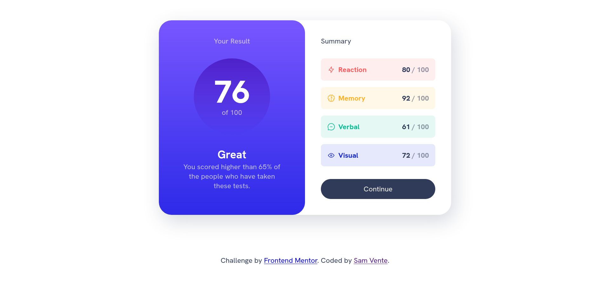

# Frontend Mentor - Results summary component solution

This is a solution to the [Results summary component challenge on Frontend Mentor](https://www.frontendmentor.io/challenges/results-summary-component-CE_K6s0maV). Frontend Mentor challenges help you improve your coding skills by building realistic projects. 

## Table of contents

- [Overview](#overview)
  - [Screenshot](#screenshot)
  - [Links](#links)
- [My process](#my-process)
  - [Built with](#built-with)
  - [What I learned](#what-i-learned)
  - [Continued development](#continued-development)
  - [Useful resources](#useful-resources)
- [Author](#author)

## Overview

### Screenshot

### Links

- [Github Repo](https://github.com/savente93/FEM-results-summary)
- [Live version](https://savente93.github.io/FEM-results-summary/)

## My process

### Built with

- Plain HTML
- CSS

### What I learned

- plan out the layout before your start
- use more divs to group things together even if they're not necessarily visualy related
- finish the entire layout first before focusing on one perticular part

### Useful resources

- [The tutorial I followed](https://www.youtube.com/watch?v=KqFAs5d3Yl8) - I found the tutorial by Kevin Powell before I found the challenge itself, so for this time I figured I'd follow along with him instead of trying myself. it was very insightfull though I'll obviously be completing the other challenges myself. 

## Author

- Website - [Sam Vente](https://sam-vente.com)
- Blog - [howtoai.fyi](https://howtoai.fyi)
- Frontend Mentor - [@yourusername](https://www.frontendmentor.io/profile/savente93)
